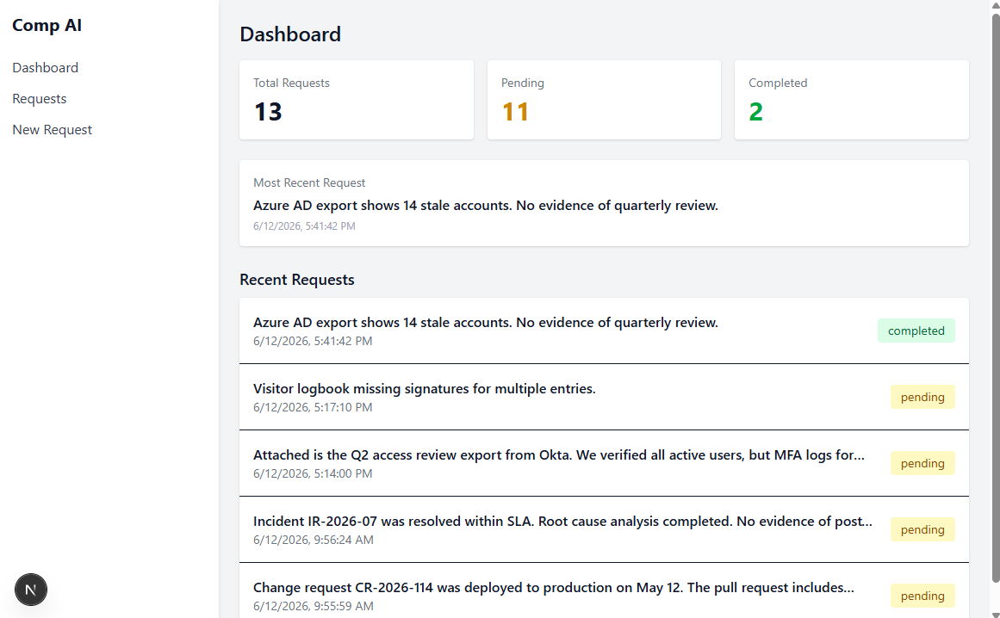
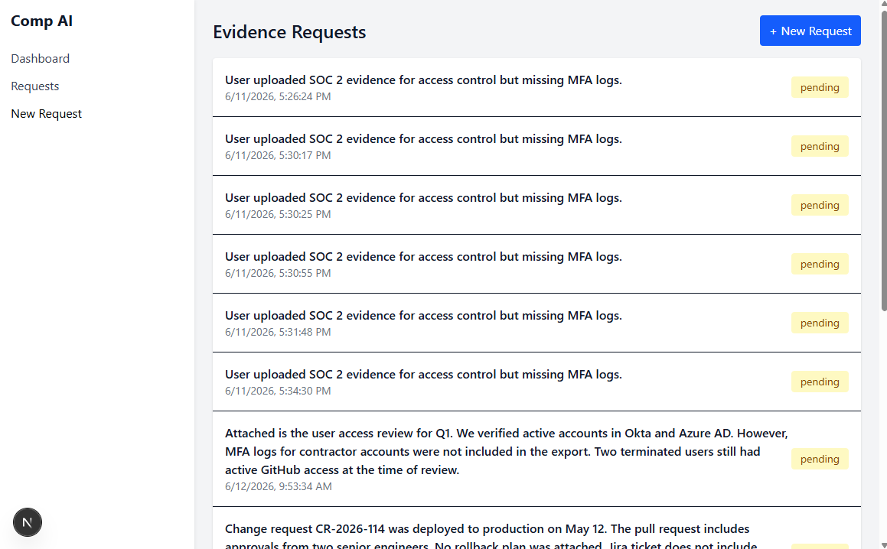
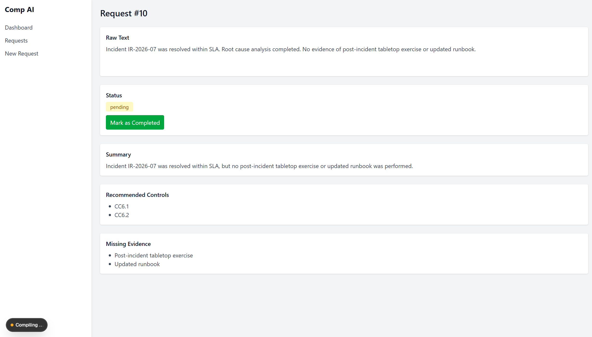

# **mini‑comp‑ai — SOC 2 Evidence Analysis Demo**

A lightweight SOC 2 evidence‑analysis application built with **NestJS + Prisma + Groq** on the backend and **Next.js (App Router) + Tailwind CSS** on the frontend.  
The app demonstrates how AI can streamline compliance workflows by summarizing evidence, identifying gaps, and recommending controls.

---

## 💡 Why This Project Exists

This project was created as an exploration into how modern AI models—specifically Groq’s ultra‑fast LLMs—can make compliance work smarter and more efficient. SOC 2 evidence review is traditionally slow, repetitive, and highly manual. By integrating AI directly into the workflow, this demo shows how engineers can automate summarization, highlight missing evidence, and surface relevant controls instantly, reducing human effort while improving consistency and speed.

## 📸 Screenshots

### Dashboard


### Requests List


### Request Detail


---

## 🚀 **Features**

### **Evidence Requests**
Submit raw SOC 2 evidence text (e.g., access reviews, incident reports, vendor assessments).  
The AI automatically generates:

- **Summary**
- **Recommended controls**
- **Missing evidence**

All requests are stored in a database with status tracking.

---

### **Dashboard**
Displays real‑time metrics:

- **Total Requests**
- **Pending**
- **Completed**

Also shows the **5 most recent requests** with status badges.

---

### **Requests List**
- View all evidence requests  
- Click into any request to see full AI analysis

---

### **Request Detail**
Shows:

- Raw text  
- Status  
- Summary  
- Recommended controls  
- Missing evidence  

Includes a **Mark as Completed** action for workflow progression.

---

### **New Request**
- Simple form to submit new evidence text  
- Automatically redirects to the newly created request  

---

## 🧱 **Tech Stack**

### **Frontend**
- Next.js 14 (App Router)
- React Server Components
- Tailwind CSS
- Fetch API (no client state libraries)

### **Backend**
- NestJS
- Prisma ORM
- SQLite (default) or any Prisma‑supported DB
- Groq API for LLM‑powered analysis

---

## 🏃‍♂️ **Running the App**

### **Backend**
```bash
cd apps/api
npm install
npm run start:dev
```

### **Frontend**
```bash
cd apps/web
npm install
npm run dev
```
Frontend runs on: **http://localhost:3000**  
Backend runs on: **http://localhost:3001**

---

## 📁 **Project Structure**
```md
apps/
  api/        # NestJS backend (evidence processing + DB)
  web/        # Next.js frontend (dashboard + UI)
```
---

## 📝 **Sample SOC 2 Inputs**

A full set of 50 realistic SOC 2 evidence samples is included in:
**SOC2-sample-requests.md**

---

## 🔄 **Status Workflow**
- New requests start as pending
- Users can mark them as completed from the detail page
- Dashboard updates automatically based on backend data
